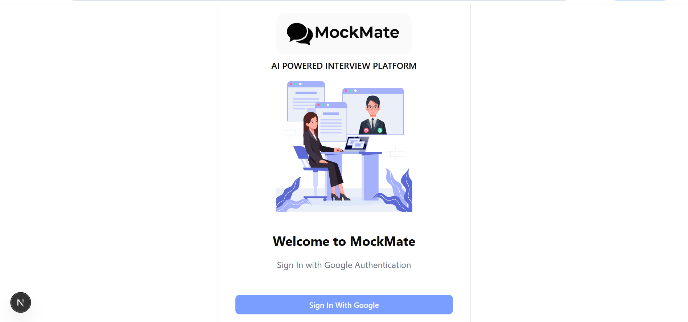
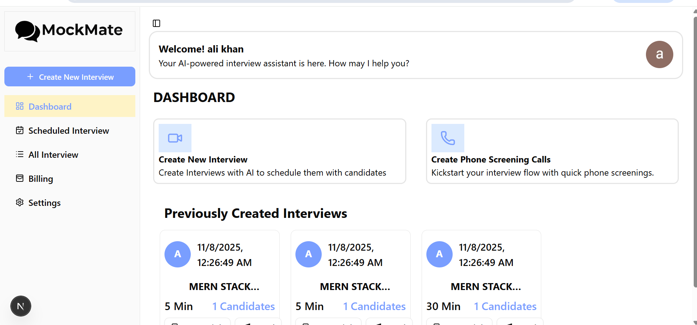
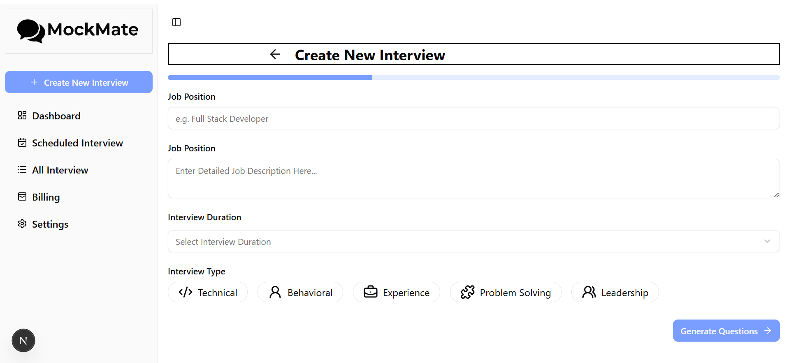
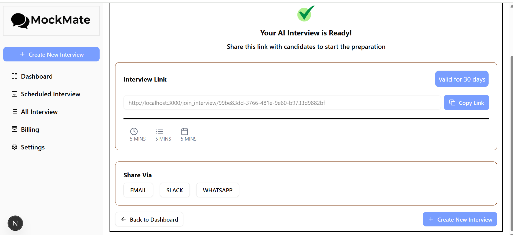
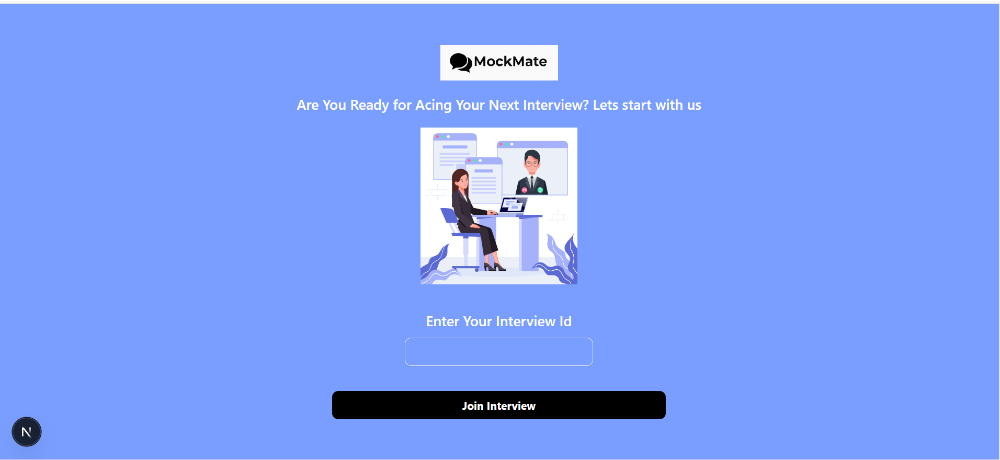
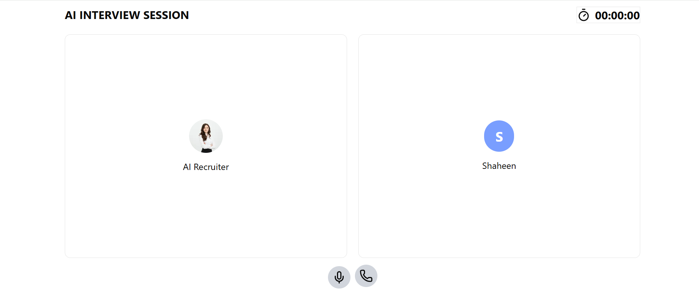
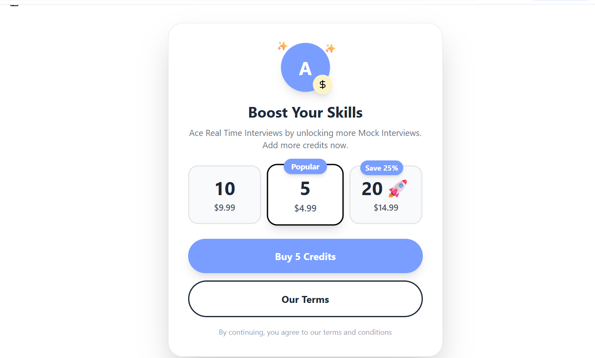

MockMate (AI Mock Interview Platform) 

MockMate is an AI-powered mock interview platform that helps users practice interviews and get personalized questions & feedback using Gemini + Vapi voice conversation. It simulates a real interview experience and evaluates answers in real-time.

✨ Features

🎤 Voice interview powered by Vapi

💡 Personalized questions based on user's preferences.

🧠 AI feedback after each interview with detailed report.

👨‍💼 HR + Technical mock interviews

🔐 Google authentication (Supabase)

💳 Stripe Integration 

🎯 Interview conversation history

🧩 Dashboard + multiple interview flows

🚀 Tech Stack
| Category   | Tech                 |
| ---------- | -------------------- |
| Frontend   | Next.js              |
| UI         | Tailwind + Shadcn    |
| Auth       | Supabase Google Auth |
| Billing    | Stripe Subscription  |
| AI         | Gemini API           |
| Voice      | Vapi                 |
| Deployment | Coming Soon          |

🧠 How MockMate Works

User signs in with Google (Supabase Auth)

Creates an interview based on personal preferences.

Gemini generates questions based on user's preferences.

Vapi starts a voice interview

After each answer feedback is generated

Final evaluation and feedback report is generated.

## 📸 Screenshots

### Sign In

### Dashboard

### Create New Interview

### Share Interview

### Join Interview 

### Start Conversation With AI 

### Billing Page

🔧 Installation
git clone https://github.com/Nomankhan30/mock_mate.git
cd mockmate
npm install
npm run dev

🔑 Environment Variables

Create .env.local and fill:

NEXT_PUBLIC_SUPABASE_URL="Your_URL"

NEXT_PUBLIC_SUPABASE_ANON_KEY="Your_Key"

OPEN_ROUTER_API_KEY="Your_Key"

GEMINI_API_KEY="Your_Key"

NEXT_PUBLIC_HOST_URL="Your_URL"

NEXT_PUBLIC_MOCK_INTERVIEWER="Your_Key"

NEXT_PUBLIC_STRIPE_PUBLIC_KEY="Your_Key"

STRIPE_SECRET_KEY="Your_Key"

NEXT_PUBLIC_STRIPE_PRICE_ID="Your_Key"

NEXT_PUBLIC_BASE_URL="Your_URL"

NEXT_PUBLIC_STRIPE_5UNIT_PRICE_ID="Your_Key"

💳 Freemium Model

MockMate operates on a freemium model designed to give every user a risk-free start to their interview preparation journey.Every new user is granted 3 free interviews upon signing in.Afterwards, user has to subscribe for more interviews.

Simplified Folder Structure:

app/
components/
lib/
utils/
hooks/
public/screenshots/

📜 License
MIT License.

🧑‍💻 Author

Built by Noman Khan 🎯

⭐ If you like it…

star the repo

report issues

suggest improvements

MockMate is under active development 🚀